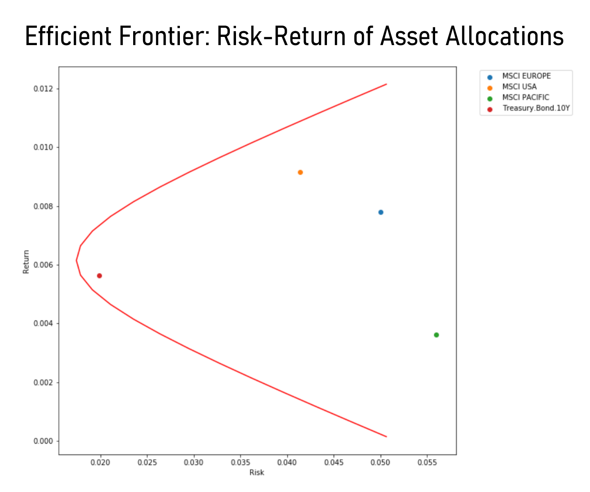
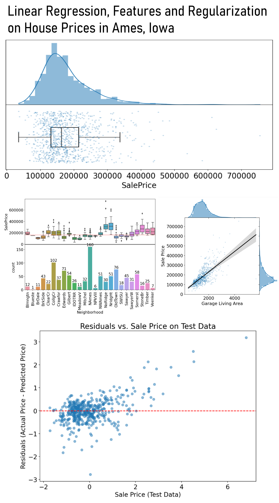

# Jeein Yune - Project Portfolio
Hello, I'm Jeein Yune

My Resume: [pdf]().

 

## Table of Contents
- [Portfolio Projects](https://github.com/jeeinyune/Data_Analysis_Portfolio/blob/main/README.md#portfolio-projects)
  - [Python](https://github.com/jeeinyune/Data_Analysis_Portfolio/blob/main/README.md#Python)
    - [Exploratory Data Analysis on NYPD Arrest Data]
    - [Portfolio Risk Analysis]
    - [Linear Regression, Features and Regularization on House Prices in Ames, Iowa]
  - [Tableau](https://github.com/jeeinyune/Data_Analysis_Portfolio/blob/main/README.md#tableau)
    - [Auto Insurance Policy Dashboard]
  - [Excel VBA](https://github.com/jeeinyune/Data_Analysis_Portfolio/blob/main/README.md#excel-vba)
    - [Financial Dashboard Automation Solutions]
- [Education](https://github.com/jeeinyune/Data_Analysis_Portfolio/blob/main/README.md#education)  
- [Certificates](https://github.com/jeeinyune/Data_Analysis_Portfolio/blob/main/README.md#certificates)
- [Contact](https://github.com/jeeinyune/Data_Analysis_Portfolio/blob/main/README.md#contacts)

 

## Portfolio Projects
### `Python`

#### 1. Exploratory Data Analysis on NYPD Arrest Data

  
<strong>Code:</strong> <a href="https://github.com/jeeinyune/Portfolio_Project/blob/main/NYPD_Arrest_Data_Python/NYPD_Arrest_Data_Python.ipynb">NYPD Arrest Data Python.ipynb</a>

  
<strong>Description:</strong> The dataset contains over 5,000,000 records from NYC OpenData, with 18 variables including arrest key, date, borough, age group, offense description, and more. The project involves data wrangling—loading, cleaning, preprocessing, and filling missing values—to uncover trends, patterns, and insights. The analysis includes charting key arrest statistics, focusing on trends over time and demographic distributions, and creating interactive plots to drill down into specific categories of arrests and demographic information.

  
<strong>Skills:</strong> data cleaning, detecting data anomalies, data analysis, dealing with outliers, data visualization, descriptive statistics.

  
<strong>Technology:</strong> Python, Pandas, Numpy, Seaborn, Matplotlib.

  

  

  #### 2. Portfolio Risk Analysis
  
<strong>Code:</strong> <a href="https://github.com/jeeinyune/Portfolio_Project/blob/main/Portfolio_Risk_Analysis/Portfolio%20Risk%20Analysis.ipynb">Portfolio Risk Analysis.ipynb</a>

  
<strong>Description:</strong> The project involves calculating portfolio weights, returns, and risks using MSCI indices and Treasury Bonds data, incorporating key statistical analyses. The analysis includes plotting efficient frontiers and asset classes on a risk-return graph, achieving a minimum variance of 8.1% and an equal-weighted portfolio return of 7.3%. Additionally, the project evaluates covariance and correlation matrices, identifying the highest covariance of 0.012 and correlation of 0.85. A beta analysis was conducted, with betas of 1.2 for MSCI AC WORLD and 1.3 for MSCI USA.

  
<strong>Skills:</strong> portfolio management, statistical analysis, data manipulation, statistical modeling, data visualization, descriptive statistics, covariance and correlation analysis, risk and return analysis, mean variance optimization, efficient frontier calculation, distribution analysis, portfolio optimization, regression analysis.

  
<strong>Technology:</strong> Python, Pandas, Numpy, Matplotlib, Statsmodels.

  

  #### 3. Linear Regression, Features and Regularization on House Prices in Ames, Iowa
  
<strong>Code:</strong> <a href="https://github.com/jeeinyune/Portfolio_Project/blob/main/House_Price_Python/House_Price_EDA1.ipynb">House Price EDA1.ipynb</a>

  
<strong>Description:</strong> The project studies house prices in Ames, Iowa using linear regression to predict sale prices from features such as size, number of bathrooms and neighborhood. While adding many features into the model, the project needs to avoid overfitting the training set using regularization along the way. And, Ridge Regression will be used to shrink the weights, requiring an extra parameter to control the extenet of shrinking. Validation will be applied to guess-and-check different values for the extra parameter.

  
<strong>Skills:</strong> Exploratory Data Analysis, Data Processing, Linear Regression, Encoding Features, Modeling, Ridge Regression, Mean Square Error 

  
<strong>Technology:</strong> Python, Pandas, Numpy, Matplotlib, Seaborn

   

### `Excel VBA`

#### 1. Financial Dashboard Automation Solutions

  
<strong>Code:</strong> <a href="">Financial Dashboard Automation Solutions.xlsm</a>

  
<strong>Description:</strong> The project involves automating the transformation of raw transaction data extracted from a personal bank account and the visualization of a monthly financial dashboard. This monthly financial dashboard features daily expenditure over the month, expenditures by category, top expenditures and expenditures on subscriptions to enable effective expense management and budget planning by identifying unecessary subscription bills and spending trends. 

  
<strong>Skills:</strong> data cleaning, data transformation, data visualization.

  
<strong>Technology:</strong> Excel VBA, pivot table, conditional formatting, data visualization, LOOKUP, SEARCH, FIND

  

### `Tableau`
  #### 1. Auto Insurance Policy Dashboard
  
<strong>Code:</strong> <a href="https://public.tableau.com/app/profile/jeein.yune5064/viz/CarInsurancePoliciesDashboard/CarInsuranceDashboard">Auto Insurance Policy Dashboard</a>

  
<strong>Description:</strong>Developed 2 Tableau dashboards to analyze auto insurance policy trends and customer demographics, providing comprehensive insights into insurance claim amounts, claim frequency, and claim counts, as well as detailed demographic data including gender, education, marital status, age, and income.

  
<strong>Skills:</strong> data analysis, data visualization.

  
<strong>Technology:</strong> Tableau

 
  
## Education
  **New York University** 
  *Bachelor of Arts in Mathematics,*  
  *Minor in Computer Science,*  
  *September 2017 - May 2021*

 
  
## Professional Exam
- [Actuarial Exam](https://github.com/jeeinyune/Portfolio_Project/blob/main/Files/soa%20Exam%20p%20Jan2021.pdf) (SOA EXAM P: Probability, Passed) (Jan 2021) 

 

## Certificates
<!-- - [Google Data Analytics Professional Certificate](https://www.coursera.org/account/accomplishments/professional-cert/LRQ498UKBBSJ?utm_source=link&utm_medium=certificate&utm_content=cert_image&utm_campaign=sharing_cta&utm_product=prof) (Sep 2022) (Coursera - Google)
- [Introduction to Data Analysis Using Excel](https://www.coursera.org/account/accomplishments/verify/62LME4DV8CUV) (May 2022) (Coursera - Rice University) -->

- Google Data Analytics Professional Certificate
- Introduction to Data Analysis Using Excel

 

## Contacts
- Email: yunejeein@gmail.com
<!-- - LinkedIn: [@tiannaparris](https://www.linkedin.com/in/tianna-parris-9b6823176/) -->
- Phone: (516)-761-4362
- Location: Renton, WA
